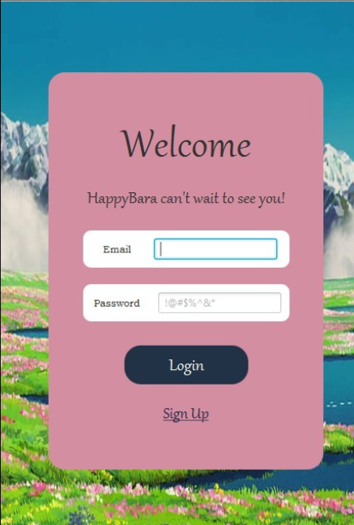
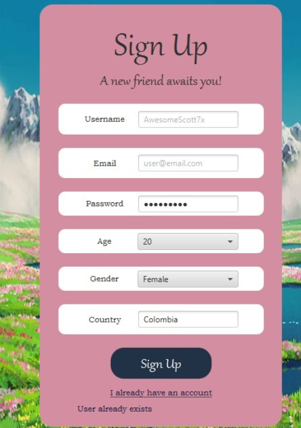
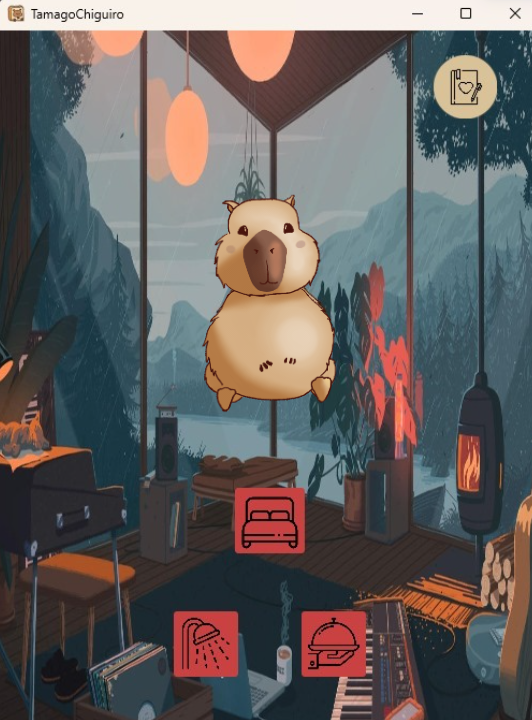
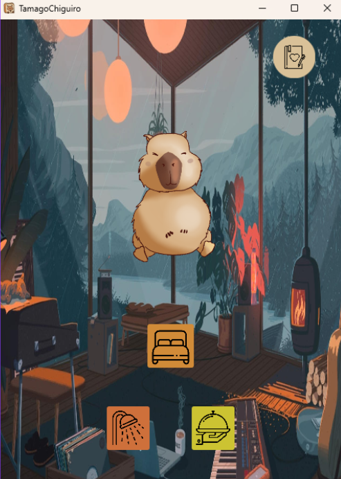
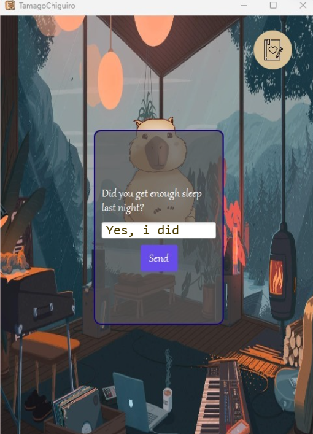
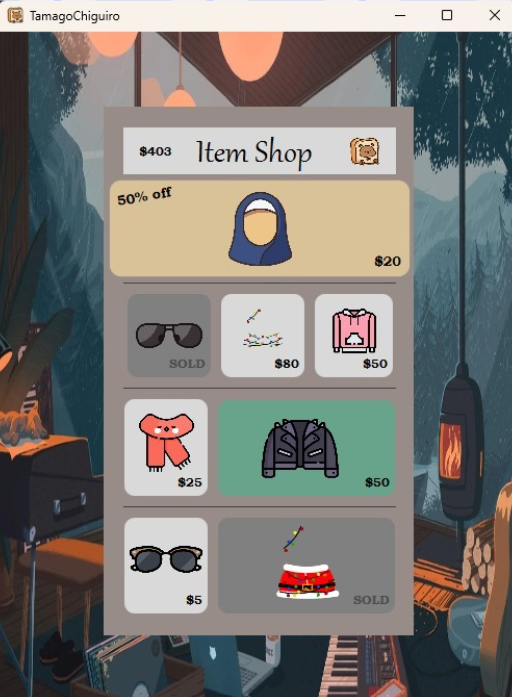
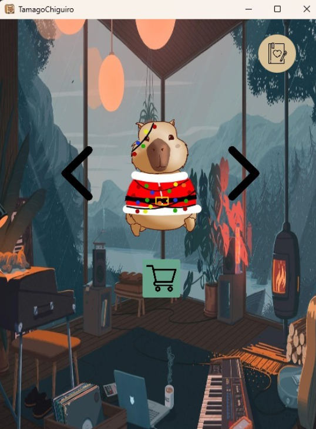

# 🐾 HappyBara

> *Your virtual capybara companion for building better daily habits.*

HappyBara is a desktop app that blends mental wellness with the charm of a virtual pet. Inspired by the Tamagotchi concept, the app encourages users to take care of their daily habits — sleep, hygiene, food — through simple interactions with a capybara companion that reacts to how well you're taking care of yourself.

---

## ✨ Features

- 🔐 **User authentication** — register and log in with email and password
- 🐱 **Virtual capybara pet** — reacts to your daily habits in real time
- 🛏️ **Habit tracking** — log sleep, hygiene, and meals through the pet's interaction buttons
- 💬 **Daily check-ins** — the capybara asks you how you're doing and responds to your answers
- 👗 **Item shop** — earn in-app currency and spend it on outfits and accessories for your capybara
- 🎄 **Seasonal cosmetics** — dress up your capybara for different occasions

---

## 📸 Screenshots

### Login & Sign Up
<p align="center">
  
  
</p>

### Main Pet Screen
<p align="center">
  
  
</p>

### Daily Check-in
<p align="center">
  
</p>

### Item Shop & Cosmetics
<p align="center">
  
  
</p>

---

## 🛠️ Tech Stack

| Layer | Technology |
|---|---|
| Language | Java |
| UI | JavaFX + CSS |
| Build Tool | Maven (`pom.xml`) |
| Platform | Desktop (Windows / Linux / macOS) |

---

## 🚀 Getting Started

### Prerequisites
- Java 17 or higher
- Maven

### Run the project

```bash
git clone https://github.com/SamAenSeidhe/HappyBara.git
cd HappyBara
mvn clean javafx:run
```

---

## 👥 Team

Developed as a university project for the **Object-Oriented Programming** course at **Universidad Nacional de Colombia**.

| Name | GitHub |
|---|---|
| Maria Catalina Rodriguez | [@Cata120804](https://github.com/Cata120804) |
| Samuel (SamAenSeidhe) | [@SamAenSeidhe](https://github.com/SamAenSeidhe) |
| Daniel Alfonso Cely | [@DanielAlfonsoCely](https://github.com/DanielAlfonsoCely) |

---

## 📄 License

This project was developed for academic purposes at Universidad Nacional de Colombia.